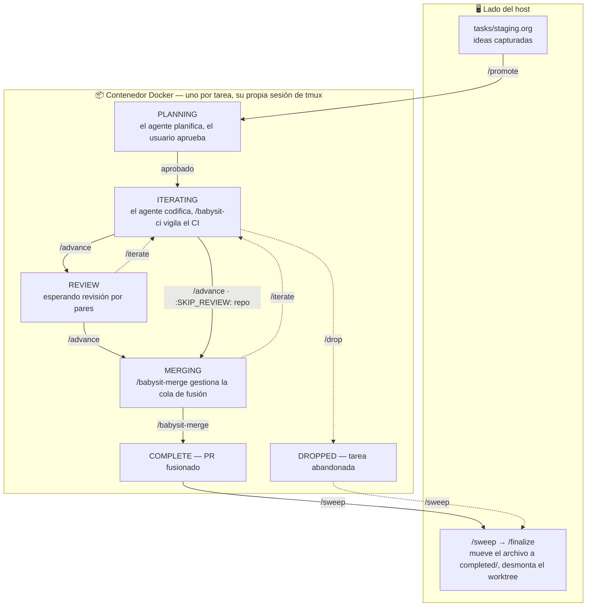

# cloude

[English](README.md) · [Español](README.es.md)

Pasa del modo solo al modo YOLO.

## Para qué sirve esto

Este repo es un sistema para paralelizar y gestionar el desarrollo dirigido
por agentes de principio a fin — desde tomar una tarea hasta entregarla.

Más allá de la sobrecarga mecánica de ejecutar Claude Code (worktrees, ramas,
gestión de PRs, trabajos programados, etc.), el objetivo más amplio es
gestionar el *flujo de trabajo* de las tareas de desarrollo de principio a
fin. Los agentes cambian la forma de ese flujo de trabajo: habilitan — y
exigen — mucha más multitarea que el desarrollo sin asistencia, con varias
piezas de trabajo en vuelo a la vez y agentes ejecutándose sin supervisión
en segundo plano.

Eso hace esencial tener un flujo de trabajo bien definido que distinga:

- **Trabajo en primer plano** — tareas que necesitan la atención activa del
  desarrollador (decisiones, revisiones, requisitos ambiguos, cambios
  riesgosos).
- **Trabajo en segundo plano** — tareas que un agente puede ejecutar hasta
  el final por sí solo, con el desarrollador revisando los resultados sólo
  cuando aterrizan.

Las herramientas en este repo existen para hacer esa distinción explícita y
mantener las cosas correctas fluyendo por el carril correcto.

## Inicio rápido

¿Nuevo en cloude? Esta sección es la vía rápida — requisitos previos,
configuración inicial, el flujo de trabajo de un vistazo, y una tarea
llevada desde la idea hasta el PR fusionado. Las secciones que siguen son
la referencia completa.

### Requisitos previos

- **Docker**, con el demonio corriendo — el agente de cada tarea se ejecuta
  en un contenedor aislado.
- **[`uv`](https://docs.astral.sh/uv/)** — ejecuta los scripts PEP 723
  (`bin/cloude-dash` y los ayudantes de archivos org) con sus dependencias
  manejadas de forma transparente.
- **`gh`**, autenticado (`gh auth login`) — usado para abrir y gestionar
  PRs.
- **`git`**.
- **Claude Code** — la CLI `claude`.

### Configuración inicial

```sh
make sync        # install pinned Python deps into ./.venv-host/ (host helpers)
make build       # build the container image (a few minutes the first time)
make login       # interactive claude login — do this once per workstation
```

`make sync` ejecuta `uv sync --frozen` contra el `pyproject.toml` +
`uv.lock` versionados y deja el venv resultante en `./.venv-host/`. Los
ayudantes del host (`bin/cloude-python` y todo lo que se re-ejecuta a
través de él) encuentran su intérprete allí; la imagen del contenedor
recibe el venv equivalente en `/opt/cloude-venv/` ya integrado por
`make build`, desde el mismo archivo de lock.

Después de que `make login` termine, tus credenciales de Claude viven en el
volumen Docker `cloude-claude-creds` y persisten en cada tarea y reinicio,
así que no necesitarás iniciar sesión de nuevo. Ejecuta `make help` para el
resto de los objetivos (rebuild, clean, etc.).

`make test` ejecuta la suite de pytest bajo `tests/` (que depende de
`sync`, así que un checkout fresco sólo necesita `make test` para llegar a
verde). La suite cubre `bin/cloude_org.py` más los scripts ayudantes / de
hook en Python en `bin/` mediante una mezcla de pruebas unitarias en
proceso y pruebas en subproceso; los ayudantes en bash quedan fuera de
alcance. El mismo objetivo corre en cada pull request en
[`.github/workflows/test.yml`](.github/workflows/test.yml).

### El flujo de trabajo de un vistazo



Las flechas continuas son el camino feliz; las flechas punteadas son las
vías de escape (`/iterate` para retroceder una etapa, `/drop` para
abandonar). Nota la división: trabajas desde el **lado del host** —
capturando ideas, promoviendo y limpiando — mientras que el agente de cada
tarea corre en su **propio contenedor y sesión de tmux**. Las transiciones
hacia adelante desde `PLANNING`, `ITERATING` y `REVIEW` están dirigidas por
el usuario; sólo `MERGING → COMPLETE` avanza por sí solo. Los repos que se
excluyen de la revisión por pares (`:SKIP_REVIEW: t`, ver [Estados del
flujo de trabajo](#estados-del-flujo-de-trabajo)) omiten `REVIEW` —
`/advance` lleva la tarea directamente de `ITERATING` a `MERGING`.

### El lado del host

El *lado del host* es donde coordinas los contenedores por tarea sin
escribir tú mismo ningún código de tarea. Son tres cosas que mantienes
abiertas:

- **Un editor sobre `tasks/staging.org`** (Emacs — los archivos de tareas
  son org-mode). Aquí es donde capturas ideas conforme surgen, como
  subencabezados bajo su proyecto, listas para `/promote` después.
- **Una sesión de Claude en el host** dentro del repo cloude. Aquí es donde
  *inicias* y *retiras* tareas: `/promote` para arrancar una, `/sweep` y
  `/finalize` para limpiarla una vez fusionada.
- **El dashboard**, `bin/cloude-dash` — una TUI que lista cada tarea con su
  etapa y una etiqueta de quién-tiene-la-pelota: `:agent:` (corriendo por
  su cuenta), `:user:` (esperándote) o `:blocked:` (esperando algo
  externo).

El trabajo en sí ocurre en otro lugar — cada tarea que `/promote` crea
corre en su propio contenedor con su propio agente de Claude. El lado del
host es el centro de control: capturar e iniciar tareas, monitorear las que
están en vuelo y limpiarlas cuando aterrizan.

Así se ve en un día típico — cada tarea en una sola pantalla, ordenada por
etapa, cada una etiquetada con quién tiene la pelota actualmente —
`:agent:`, `:user:` o `:blocked:` (la TUI en vivo también codifica la
etiqueta con colores) — y rotulada con el repo al que pertenece:

```text
cloude tasks      ↑/↓ move  p open PR  t tmux  c copy slug  P promote  r reload  q quit

ACTIVE (4)
  MERGING   :agent:    Cache the dashboard customer lookup PR #312  Acme Webapp
  REVIEW    :blocked:  Add rate-limit headers to the API      PR #305  Acme API
> ITERATING :user:     Create a quickstart guide for cloude     PR #298  Cloude
  PLANNING  :user:     Migrate the billing cron job            PR #314  Billing
STAGING (2)
  —                    Retry webhook deliveries with backoff  Acme API
  —                    Drop the legacy /v1 search endpoint    Acme API
RECENT (2)
  COMPLETE  2026-05-14  fix-flaky-auth-retry-test               Cloude
  DROPPED   2026-05-12  prototype-graphql-gateway          Acme Webapp
```

Las filas `:user:` son el punto — las tareas que necesitan feedback ahora
mismo (un prompt de planificación, un plan que aprobar, una decisión).
Resalta una y presiona `t` para entrar directamente en esa tarea, dale al
agente lo que necesita, luego salta de vuelta al dashboard y pasa a la
siguiente fila `:user:`. Monitoreas desde el lado del host y te metes en
una tarea sólo donde se requiere atención, de modo que el trabajo en
segundo plano se quede en segundo plano.

Ejecuta `bin/cloude-dash` dentro de una sesión de tmux para hacer ese salto
fluido: con el dashboard en tmux, `t` usa `tmux switch-client` (en vez de
`attach`), así que voltear hacia la sesión de una tarea es instantáneo.
Para regresar, usa el atajo por defecto de tmux para "cambiar a la última
sesión" — `Ctrl-b L` — que te deja directamente en el dashboard, sin
desconectar ni reconectar.

Presiona `c` sobre una tarea resaltada para copiar su slug — el `<slug>` de
`YYYY-MM-DD-<slug>.org`, y el identificador con el que la rama, el
worktree y la sesión de tmux están todos nombrados — al portapapeles del
sistema, listo para pegarlo en un comando.

Presiona `P` sobre una fila STAGING resaltada para promoverla sin salir del
dashboard. Curses se suspende, `bin/cloude-promote` ejecuta la cadena
completa (descubrimiento por gh + worktree + draft PR + sesión de tmux), y
el dashboard regresa cuando presiones Enter. La nueva fila ACTIVE aparece
en la próxima recarga; presiona `t` sobre ella para conectarte a la sesión
de tmux de la nueva tarea.

```sh
bin/cloude-dash    # /: search · p: open PR · t: switch to task · c: copy slug · r: reload · q: quit
```

Ver [Panel](#panel) para la lista completa de teclas.

### Tu primera tarea

1. **Agrega el proyecto a `tasks/staging.org`.** Si el repo en el que
   quieres trabajar todavía no tiene un encabezado de nivel superior en
   `tasks/staging.org`, añade uno. El encabezado lleva una propiedad
   `:REPO:` apuntando al repo de GitHub, más un `:SKIP_REVIEW: t` opcional
   si el repo se excluye de la revisión por pares (ver [estructura de
   staging.org](#estructura-de-stagingorg)). Una sola vez por repo.
2. **Captura la idea.** Añade un subencabezado bajo ese proyecto — una o
   dos líneas describiendo lo que quieres hacer. Este es el prompt con el
   que arrancará el agente de planificación.
3. **Promuévela.** Ejecuta `/promote` desde tu sesión de Claude en el host.
   Crea el archivo de tarea activa, una rama `cloude/<slug>`, un worktree,
   un draft PR y una sesión de tmux desacoplada `cloude-<slug>` con dos
   ventanas: la ventana 0 (`agent`) ejecuta el contenedor por tarea, la
   ventana 1 (`task`) abre el archivo `.org` de la tarea en un editor de
   terminal de sólo lectura y con auto-revert (`emacs -nw`, o si no
   `$EDITOR`). La tarea inicia en `PLANNING :user:` — esperándote.
4. **Planifica.** Conéctate a la sesión de tmux de la tarea (`tmux attach
   -t cloude-<slug>`, o presiona `t` en el dashboard); la ventana `agent`
   está seleccionada por defecto, `Ctrl-b 1` cambia a la vista en vivo del
   archivo de tarea. La caja de entrada del agente viene pre-rellenada con
   la entrada de staging promovida como prompt de planificación — presiona
   Enter para iniciar, o edítala primero. El agente redacta un plan y tú
   iteras con él como una conversación normal de Claude Code — haz
   preguntas, empuja contra el alcance, redirige — durante tantos turnos
   como necesites. Los hooks voltean el encabezado entre `:agent:` (hay un
   turno en curso) y `:user:` (esperándote), de modo que el dashboard
   refleje quién tiene la pelota. Cuando aceptas el plan a través de la
   confirmación del modo plan de Claude Code, un hook voltea la tarea a
   `ITERATING :agent:` automáticamente y el agente empieza a implementar.
5. **Itera.** El agente implementa el plan y empuja; `/babysit-ci` vigila
   el CI después de cada push. Igual que en la planificación, puedes
   conversar con el agente durante todo el proceso — revisa lo que ha
   empujado, pide cambios, redirige a mitad de implementación — y la
   etiqueta del encabezado voltea con cada turno. Cuando el trabajo está
   hecho el agente voltea su etiqueta a `:user:`, y esa es tu señal: o le
   das más feedback (volver al paso 5) o ejecutas `/advance` para mover
   `ITERATING → REVIEW → MERGING`.
6. **Fusiona.** En `MERGING`, `/babysit-merge` gestiona la cola de fusión y
   auto-avanza la tarea a `COMPLETE` una vez que el PR aterriza.
7. **Limpia.** De vuelta en el host, `/sweep` saca a la luz las tareas
   terminadas y `/finalize` mueve el archivo a `tasks/completed/` y
   desmonta el worktree, la sesión de tmux y la rama.

### A dónde ir después

- [Estados del flujo de trabajo](#estados-del-flujo-de-trabajo) — qué
  significa cada palabra clave TODO.
- [Comandos slash](#comandos-slash) — detalle completo sobre `/promote`,
  `/advance`, `/babysit-ci`, `/finalize` y los demás.
- [`docs/internals.md`](docs/internals.md) — la referencia de cableado
  orientada al agente (scripts ayudantes, hooks en contenedor, internals
  del contenedor).

## Seguimiento de tareas

Cada fragmento de trabajo — su estado actual y su historia completa — se
rastrea en un archivo `org-mode` de Emacs. El diseño está pensado para que
varios agentes puedan actualizar el estado de las tareas concurrentemente
sin chocar:

```
tasks/
  staging.org            ;; lightweight captures, not yet started
  active/                ;; one file per in-flight task
    YYYY-MM-DD-<slug>.org
  completed/             ;; one file per merged task (COMPLETE)
    YYYY-MM-DD-<slug>.org
  dropped/               ;; one file per abandoned task (DROPPED)
    YYYY-MM-DD-<slug>.org
  TEMPLATE.org           ;; scaffold for new active tasks (copy, don't edit)
```

- **El estado de alto nivel** se codifica por el directorio en el que vive
  la tarea (`tasks/staging.org` → `tasks/active/` → `tasks/completed/` o
  `tasks/dropped/`). La vista panorámica viene de los listados de
  directorio, no de un archivo de índice global.
- **La etapa del flujo de trabajo** se codifica por la palabra clave TODO
  dentro de cada archivo activo (ver abajo), de modo que el logbook de
  org-mode captura cada transición de estado.
- **Un archivo por tarea** significa que cada agente edita su propio
  archivo. Los agentes concurrentes que actualizan sus propias tareas no
  chocan.

El encabezado de cada archivo de tarea activa lleva una properties drawer
con metadatos (`:REPO:`, `:BRANCH:`, `:WORKTREE:`, `:PR:`, etc.) que el
agente rellena conforme la tarea progresa. Normalmente no editas esos
campos a mano — ver [`docs/internals.md`](docs/internals.md) para el
esquema completo.

### Estados del flujo de trabajo

| Estado       | Significado                                                                                                       | Puede moverse a                                |
| ------------ | ----------------------------------------------------------------------------------------------------------------- | ---------------------------------------------- |
| `PLANNING`   | Claude está planificando el trabajo.                                                                              | `ITERATING`, `DROPPED`                         |
| `ITERATING`  | Claude está escribiendo código, ejecutando pruebas, actualizando el título / descripción del PR, esperando al CI. | `REVIEW` (o `MERGING`, ver abajo), `DROPPED`   |
| `REVIEW`     | El PR está abierto a revisión por pares, esperando comentarios.                                                   | `ITERATING`, `MERGING`, `DROPPED`              |
| `MERGING`    | El PR está aprobado y listo para fusionarse.                                                                      | `COMPLETE`, `DROPPED`                          |
| `COMPLETE`   | El PR está fusionado. Terminal.                                                                                   | —                                              |
| `DROPPED`    | Tarea abandonada. Terminal.                                                                                       | —                                              |

Las transiciones hacia adelante desde `PLANNING`, `ITERATING` y `REVIEW`
están **dirigidas únicamente por el usuario** — el agente no avanza estos
estados por sí mismo; debe esperar a que el usuario tome la decisión.
Cualquier estado puede transicionar a `DROPPED` en cualquier momento.

**Saltarse la revisión por pares.** Un repo puede excluirse de la revisión
por pares. Cuando la properties drawer de una tarea lleva
`:SKIP_REVIEW: t` (copiado desde su proyecto de staging — ver [estructura
de staging.org](#estructura-de-stagingorg)), `/advance` se salta la etapa
`REVIEW` y mueve la tarea directamente de `ITERATING` a `MERGING`. La
palabra clave `REVIEW` sigue existiendo; simplemente nunca se entra en ese
estado para esas tareas.

### Etiqueta de quién tiene la pelota

Cada tarea en vuelo lleva una etiqueta de org en su encabezado indicando
quién tiene la pelota actualmente:

- `:agent:` — el agente está trabajando autónomamente.
- `:user:` — la pelota está en la cancha del usuario (el agente está
  esperando feedback del usuario, una decisión, o un prompt para
  continuar).
- `:blocked:` — esperando algo externo a este flujo de trabajo (revisores
  pares, CI externo de larga duración, una dependencia upstream, etc.).

El agente voltea su propia etiqueta conforme transiciona entre trabajar,
esperar al usuario y esperar algo externo. **No** avanza el estado TODO por
sí mismo (excepto `MERGING → COMPLETE`) — esa es decisión del usuario.

### Estructura de staging.org

Los encabezados de nivel superior en `tasks/staging.org` son **proyectos**.
Un proyecto lleva una propiedad `:REPO:` que apunta a su repo de GitHub,
así que cuando una tarea se promueve de staging a activa el agente sabe en
qué repo abrir una rama. Las ideas viven como subencabezados bajo su
proyecto:

```org
* cloude
  :PROPERTIES:
  :REPO: https://github.com/<org>/cloude
  :END:
** Add a task-promotion script
** Hook to auto-move COMPLETE files
```

Un proyecto también puede llevar una propiedad opcional `:SKIP_REVIEW: t`.
Marca un repo que no requiere revisión por pares: `/promote` la copia en
cada archivo de tarea promovida desde ese proyecto (de la misma manera que
viaja `:REPO:`), y `/advance` entonces se salta la etapa `REVIEW` para esas
tareas (ver [Estados del flujo de
trabajo](#estados-del-flujo-de-trabajo)). Omítela para los repos que sí
requieren revisión — ese es el comportamiento por defecto.

```org
* cloude-cade
  :PROPERTIES:
  :REPO: https://github.com/<org>/cloude-cade
  :SKIP_REVIEW: t
  :END:
** Add a task-promotion script
```

**Propiedades a nivel de idea.** Cada subencabezado de idea puede llevar
opcionalmente su propia properties drawer con `:ADOPT:`, `:COMPANION:` y/o
`:SLUG:`:

- `:ADOPT: <PR url>` — promueve esta idea como una tarea en **modo ADOPT**:
  no se crea una rama ni un PR nuevo; la rama del PR existente se hace
  checkout como un worktree y la tarea inicia en `ITERATING :user:`. El
  texto del encabezado y el cuerpo son de forma libre (usados como
  pre-rellenado del prompt de iteración, igual que en el modo estándar).
- `:COMPANION: <task-id>` — esta tarea está emparejada con una tarea cloude
  hermana (ID con fecha-slug, p. ej.
  `2026-05-15-acme-service-new-endpoint`). La propiedad se copia tal cual a
  la properties drawer del nuevo archivo de tarea activa; ver
  [`docs/internals.md`](docs/internals.md) para saber qué significa aguas
  abajo.
- `:SLUG: <slug>` — sobrescribe el slug de tarea derivado automáticamente.
  Por defecto el slug se deriva del encabezado (minúsculas, no
  alfanuméricos reemplazados con `-`, recortado); fijar `:SLUG:` te permite
  fijar un slug más corto o de otro modo distinto. El slug es por lo que se
  nombran el archivo de tarea (`tasks/active/YYYY-MM-DD-<slug>.org`), la
  rama de feature (`cloude/<slug>`), el worktree y la sesión de tmux
  (`cloude-<slug>`).

Todas son opcionales; `/promote` las lee de la idea de staging y las
reenvía mediante flags al orquestador. El texto del encabezado nunca se
busca por patrón para inferir ninguna de ellas — son propiedades o nada.

```org
* cloude-cade
  :PROPERTIES:
  :REPO: https://github.com/<org>/cloude-cade
  :SKIP_REVIEW: t
  :END:
** Take over the WIP refactor from someone else's branch
   :PROPERTIES:
   :ADOPT: https://github.com/<org>/cloude-cade/pull/42
   :END:
** Wire the new endpoint into the dashboard
   :PROPERTIES:
   :COMPANION: 2026-05-15-acme-service-new-endpoint
   :END:
** A long heading whose default slug would be unwieldy
   :PROPERTIES:
   :SLUG: short-name
   :END:
```

Un encabezado de nivel superior **sin** `:REPO:` se trata como un
**proyecto TODO** — sus subencabezados son TODOs personales en los que el
usuario trabaja por su cuenta, no tareas promocionables dirigidas por
agentes. En el dashboard cada entrada aparece bajo un encabezado de sección
que coincide con su palabra clave TODO de org (`DONE`, `WAITING`, …), con
las entradas que no tienen palabra clave cayendo a una sección `TODO` por
defecto. `/promote` los omite:

```org
* Non-cloude
** Get recall precision curve for recent predictions in live nation
** Reply to the design doc thread
```

Puedes borrar los TODOs cuando termines — no hay una pila separada de
"completados" para ellos.

## Panel

`bin/cloude-dash` es una TUI en curses que presenta el estado de cada
tarea en una sola pantalla. Parsea cada archivo `tasks/**/*.org` con
`orgparse` y renderiza las siguientes secciones:

- **ACTIVE** — una fila por archivo en `tasks/active/`, ordenada por
  prioridad de etapa (`MERGING` primero, luego `REVIEW`, `ITERATING`,
  `PLANNING`). Cada fila muestra la palabra clave TODO, quién tiene la
  pelota actualmente (`:agent:` verde, `:user:` amarillo, `:blocked:`
  rojo), el encabezado, luego una etiqueta de repo alineada a la derecha
  y el número de PR de la propiedad `:PR:`. Una tarea que ha alcanzado un
  estado terminal (`COMPLETE`/`DROPPED`) pero aún está esperando
  `/finalize` del lado del host no muestra etiqueta de pelota — la
  etiqueta sólo es significativa mientras la tarea está en vuelo.
- **STAGING** — subencabezados de idea bajo proyectos de nivel superior
  que tienen una propiedad `:REPO:` (es decir, promocionables vía
  `/promote`).
- **Una sección por palabra clave TODO** para subencabezados de idea bajo
  proyectos de nivel superior que no tienen `:REPO:` (TODOs personales en
  los que el usuario trabaja sin un agente). La palabra clave misma es el
  encabezado de sección — p. ej. `DONE`, `WAITING`. Las entradas sin
  palabra clave caen a un encabezado `TODO` por defecto. Estas secciones
  se renderizan alfabéticamente por palabra clave entre `STAGING` y
  `RECENT`, y cada fila lleva el nombre del proyecto entre corchetes como
  prefijo (p. ej. `[Live Nation] …`). No son promocionables.
- **RECENT** — los 20 archivos modificados más recientemente de
  `tasks/completed/` y `tasks/dropped/`.

Las filas ACTIVE, STAGING y RECENT llevan la etiqueta del repo al que
pertenece la tarea, mostrada alineada a la derecha justo a la izquierda
del número de PR. La etiqueta es el **encabezado de sección del proyecto
de `staging.org`** — el nombre humano del proyecto de nivel superior al
que pertenece la URL `:REPO:` de la tarea. El dashboard invierte las
propiedades `:REPO:` de los proyectos de staging en un mapa URL →
encabezado, de modo que una tarea activa o reciente que lleva la misma
URL `:REPO:` se muestra bajo el nombre de su proyecto. Una tarea cuyo
`:REPO:` no coincide con ningún proyecto de staging cae a una etiqueta
`owner/repo`. Las filas de TODO personal (proyectos sin repo) no llevan
etiqueta de repo.

Teclas: `↑`/`↓` o `j`/`k` mueven, `g`/`G` saltan al inicio/final, `p`
abre el PR de la tarea resaltada en el navegador por defecto, `t` cambia
a su sesión de tmux `cloude-<slug>` (usa `tmux switch-client` cuando el
dashboard ya está dentro de tmux, en otro caso `tmux attach`), `c` copia
al portapapeles el slug de la tarea ACTIVE/RECENT resaltada, `P` promueve
la idea STAGING resaltada vía `bin/cloude-promote` (curses se suspende
durante la ejecución; presiona Enter para regresar), `r` recarga, `q`
sale.

Presiona `/` para entrar en modo de búsqueda mientras escribes. La línea
de estado muestra la consulta conforme la escribes; las filas se filtran
al estilo fzf a aquellas cuyo título contiene la consulta (substring sin
distinguir mayúsculas), y los encabezados de sección sobrevivientes
muestran `(matched/total)` para que veas qué se ha filtrado. `↑`/`↓`
siguen navegando la lista filtrada mientras escribes. `Esc` limpia la
consulta y sale del modo búsqueda; `Enter` bloquea el filtro,
restaurando el mapa normal de teclas (`j`/`k`/`p`/`t`/`c`/`P`/`g`/`G`/`r`)
sobre el conjunto filtrado — `Esc` mientras está bloqueado limpia el
filtro, y `/` desde un filtro bloqueado inicia una nueva consulta.

El dashboard se recarga automáticamente (vía inotify) cada vez que un
archivo de tarea cambia, y una recarga puede reordenar las filas — una
transición de etapa reordena una tarea dentro de ACTIVE, una tarea nueva
puede aparecer arriba de ella, o puede moverse a RECENT. El resaltado
sigue la *tarea*, no el índice de fila: a través de cualquier recarga
(automática o `r`) se queda en la tarea que tenías seleccionada. Si esa
tarea desaparece por completo, el resaltado cae a la primera fila.

```sh
bin/cloude-dash
```

El script tiene un encabezado de dependencias en línea PEP 723, así que
el lanzador recomendado es `uv` — él maneja la instalación de `orgparse`
de forma transparente. Si `uv` no está disponible, `pip install --user
orgparse` y luego ejecuta el script con `python3`.

## Hooks por repo previos al lanzamiento

Algunos proyectos traen configuración que no se comporta bien dentro del
contenedor por tarea — entradas de plugin que apuntan a binarios del
host, skills de proyecto que dependen de servicios externos, etc. Para
dar forma al worktree antes de que arranque el contenedor, deja un
script ejecutable en:

```
repo-hooks/<repo-name>          (e.g. repo-hooks/acme-webapp)
```

El lanzador invoca el hook (si está presente y es ejecutable) con cwd =
el worktree, justo antes de lanzar el contenedor. El hook recibe estas
variables de entorno:

- `CLOUDE_WORKTREE` — ruta absoluta del worktree de la tarea.
- `CLOUDE_TASK_FILE` — ruta absoluta del archivo `.org` de la tarea
  activa.
- `CLOUDE_REPO_NAME` — el nombre del repo (coincide con el nombre del
  archivo del hook).

Un hook que falla (salida no-cero) aborta el lanzamiento.

Uso típico: borrar o editar un archivo que el contenedor no debería ver,
luego ocultar el cambio de `git status` vía `git update-index
--skip-worktree <file>` (para archivos rastreados) o añadiéndolo a
`.git/info/exclude` (para archivos no rastreados). Los worktrees tienen
su propio `index` e `info/exclude`, así que estos cambios están aislados
a un único worktree.

## Comandos slash

Los comandos slash de ámbito de proyecto viven en `.claude/commands/`.
Los que invocas a mano:

**Lado del host** (ejecutados desde tu sesión de Claude en el host,
dentro del repo cloude):

- **`/promote`** — Promueve una idea desde `tasks/staging.org` a una
  tarea activa. Interactivo: lista las ideas agrupadas por proyecto,
  pregunta cuál promover, luego entrega el control por completo a
  `bin/cloude-promote` (un orquestador determinista en Python que
  realiza el descubrimiento por gh, la derivación de slug y el cableado
  de flags sin ninguna intervención de LLM). El modo estándar crea una
  rama `cloude/<slug>`, un worktree bajo `worktrees/<repo-name>/<slug>`,
  un draft PR y una sesión de tmux desacoplada `cloude-<slug>` — inicia
  en `PLANNING :user:`, con la caja de entrada de Claude Code del
  contenedor pre-rellenada con la entrada de staging como prompt de
  planificación. Si la idea de staging lleva una propiedad
  `:ADOPT: <PR url>` (ver [estructura de
  staging.org](#estructura-de-stagingorg)), cambia a **modo ADOPT**: no
  hay nueva rama ni PR, hace checkout de la rama del PR existente e
  inicia en `ITERATING :user:` con la entrada de staging pre-rellenada
  como prompt de iteración para que puedas dirigir al agente sobre qué
  hacer con el trabajo adoptado. Como el orquestador es determinista,
  la tecla `P` del dashboard puede ejecutarlo directamente — ver
  [Panel](#panel).
- **`/sweep`** — Escanea `tasks/active/` buscando tareas cuya palabra
  clave TODO ya es `COMPLETE` o `DROPPED` (el agente en el contenedor
  ha cambiado el estado pero el archivo sigue en `active/`). Para cada
  candidato, pregunta `Approve /finalize for <task>? [y/N/skip]` y sólo
  invoca `/finalize` con un `y` explícito. Rápido de ejecutar (una
  línea de salida cuando no hay nada pendiente), así que es seguro
  dirigirlo en un poll `/loop` (p. ej. `/loop 1m /sweep`) en tu sesión
  principal del host.
- **`/finalize`** — Finaliza una tarea activa y realiza la limpieza que
  el agente en el contenedor no puede hacer (el repo cloude está
  montado de sólo lectura desde dentro del contenedor). Interactivo:
  lista las tareas activas con su estado TODO actual, pregunta cuál
  finalizar. Para `COMPLETE`, verifica que el PR esté fusionado, mata
  la sesión de tmux, elimina el worktree y el volumen DinD de la
  tarea, borra la rama local y mueve el archivo de tarea a
  `tasks/completed/`. Para `DROPPED`, cierra el PR, mata la sesión de
  tmux, elimina el worktree y el volumen DinD, preserva la rama local
  y mueve el archivo a `tasks/dropped/`. El force-drop está permitido
  desde cualquier estado no terminal; force-complete no lo está
  (COMPLETE requiere que el agente haya verificado la fusión).

**Dentro del contenedor** (ejecutados desde dentro de la sesión de tmux
de la tarea):

- **`/advance`** — Avanza la palabra clave TODO de la tarea a la
  siguiente etapa del flujo de trabajo (`PLANNING → ITERATING → REVIEW
  → MERGING → COMPLETE`, o `ITERATING → MERGING` directamente cuando
  la propiedad `:SKIP_REVIEW:` de la tarea está activa — ver [Estados
  del flujo de trabajo](#estados-del-flujo-de-trabajo)). Presenta la
  Definition of Done de la etapa actual y se queja si algo no se
  cumple antes de realizar la transición.
- **`/iterate`** — Vuelve la palabra clave TODO a `ITERATING` (con la
  etiqueta `:agent:`). Se usa cuando llegan comentarios de revisión en
  un PR en `REVIEW`, o cuando una tarea en `MERGING` se rompe en la
  fusión.
- **`/drop`** — Voltea la palabra clave TODO a `DROPPED` (con la
  etiqueta `:user:`) desde cualquier estado no terminal. Se niega a
  hacer drop desde `COMPLETE` (el trabajo ya aterrizó); te recuerda
  que el host ahora necesita `/sweep` (o `/finalize` directamente)
  para hacer la limpieza real.
- **`/babysit-ci`** — Monitorea el CI del PR de la tarea autónomamente
  después de un push. Dirigido por push: arranca `gh pr checks
  --watch` como un trabajo en segundo plano; el agente se despierta
  cuando el watch retorna. Verde voltea la etiqueta del encabezado a
  `:user:` y se detiene (las transiciones TODO hacia adelante están
  dirigidas por el usuario); los fallos se diagnostican, se arreglan,
  se empujan y se vigilan de nuevo. Los **conflictos de fusión**
  contra la rama base también son parte del trabajo: el agente fusiona
  la base más reciente, resuelve conflictos triviales (lockfiles,
  append-only, formateo), y vuelve a empujar — sólo escala a `:user:`
  cuando un conflicto realmente necesita juicio humano. Costo de
  tokens cero durante el watch — Claude está completamente inactivo
  hasta que el CI termina.
- **`/babysit-merge`** — El equivalente de etapa MERGING de
  `/babysit-ci`. Añade el PR a la cola de fusión del repo, vigila vía
  un trabajo en segundo plano, vuelve a encolar en expulsiones
  transitorias — "sigue volviendo a añadir hasta que se fusione". Tras
  una fusión exitosa, **auto-avanza el encabezado a `COMPLETE :user:`**
  (la única transición hacia adelante que el agente posee, ya que
  `/sweep` en el host entonces lo presenta para `/finalize`). Ante
  cualquier condición bloqueante (chequeo requerido fallido, cambios
  solicitados, conflicto de fusión, rechazo por protección de rama),
  **devuelve la tarea a `ITERATING :user:`** con una explicación de un
  párrafo añadida a `** Notes` — la resolución de conflictos es
  trabajo de `/babysit-ci` durante ITERATING, no de esta skill.

## Detalles internos

Para los detalles de cableado orientados al agente — los scripts
ayudantes a los que los comandos slash llaman por shell, los hooks
dentro del contenedor que mantienen sincronizado el encabezado de la
tarea, el contenedor Docker por tarea, el esquema de la properties
drawer de la tarea activa — ver [`docs/internals.md`](docs/internals.md).
Los humanos normalmente no necesitan nada de eso.
