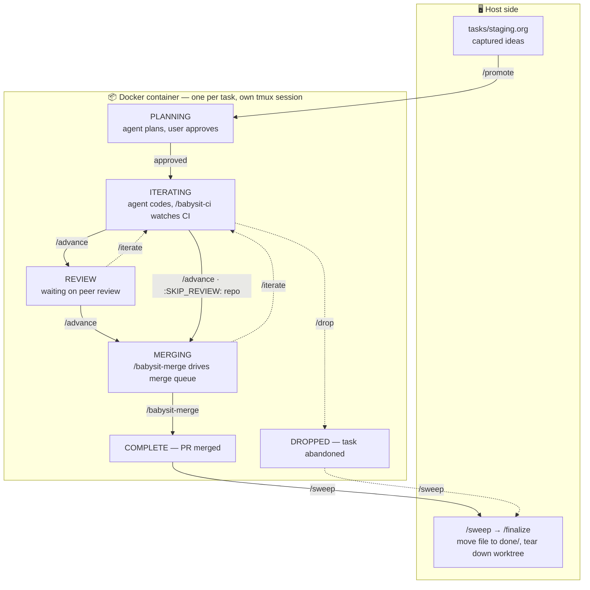

# cloude

Go from solo mode to YOLO mode.

## What this is for

This repo is a system for parallelizing and managing agent-driven
development end-to-end — from picking up a task to landing it.

Beyond the mechanical overhead of running Claude Code (worktrees, branches,
PR triage, scheduled jobs, etc.), the larger goal is to manage the
*workflow* of development tasks from beginning to end. Agents change the
shape of that workflow: they enable — and require — far more multitasking
than unassisted development, with several pieces of work in flight at once and
agents running unattended in the background.

That makes it essential to have a well-defined workflow that distinguishes:

- **Foreground work** — tasks that need active developer attention
  (decisions, reviews, ambiguous requirements, risky changes).
- **Background work** — tasks an agent can run to completion alone, with
  the developer only checking results when they land.

The tools in this repo exist to make that distinction explicit and to keep
the right things flowing through the right lane.

## Quickstart

New to cloude? This section is the fast path — prerequisites, one-time
setup, the workflow at a glance, and one task taken from idea to merged
PR. The sections below it are the full reference.

### Prerequisites

- **Docker**, with the daemon running — every task's agent runs in a
  sandboxed container.
- **[`uv`](https://docs.astral.sh/uv/)** — runs the PEP 723 scripts
  (`bin/cloude-dash` and the org-file helpers) with their dependencies
  handled transparently.
- **`gh`**, authenticated (`gh auth login`) — used to open and manage PRs.
- **`git`**.
- **Claude Code** — the `claude` CLI.

### One-time setup

```sh
make sync        # install pinned Python deps into ./.venv-host/ (host helpers)
make build       # build the container image (a few minutes the first time)
make login       # interactive claude login — do this once per workstation
```

`make sync` runs `uv sync --frozen` against the checked-in
`pyproject.toml` + `uv.lock` and drops the resulting venv at
`./.venv-host/`. The host helpers (`bin/cloude-python` and anything
that re-execs through it) find their interpreter there; the container
image gets the matching venv at `/opt/cloude-venv/` baked in by
`make build`, from the same lockfile.

After `make login` exits, your Claude credentials live in a
per-vault `cloude-claude-creds-<vault-slug>` Docker volume and persist
across every task and restart, so you won't need to log in again for
that vault. (See [Vaults](#vaults) for how repos are partitioned across
vaults — `make login` targets your default vault on first run.) Run
`make help` for the rest of the targets (rebuild, clean, etc.).

`make test` runs the pytest suite under `tests/` (which depends on
`sync`, so a fresh checkout just needs `make test` to land on green).
The suite covers `bin/cloude_org.py` plus the Python helper / hook
scripts in `bin/` via a mix of in-process unit tests and subprocess
tests; the bash helpers are out of scope. The same target runs on
every pull request in [`.github/workflows/test.yml`](.github/workflows/test.yml).

### The workflow at a glance



Solid arrows are the happy path; dashed arrows are the escape hatches
(`/iterate` back a stage, `/drop` to abandon). Note the split: you work
from the **host side** — capturing ideas, promoting, and cleaning
up — while each task's agent runs in its **own container and tmux
session**. Forward
transitions out of `PLANNING`, `ITERATING`, and `REVIEW` are user-driven;
only `MERGING → COMPLETE` advances on its own. Repos that opt out of
peer review (`:SKIP_REVIEW: t`, see [Workflow states](#workflow-states))
skip `REVIEW` — `/advance` takes the task straight from `ITERATING` to
`MERGING`.

### The host side

The *host side* is where you coordinate the per-task containers without
writing any task code yourself. It is three things you keep open:

- **An editor on `tasks/staging.org`** (Emacs — the task files are
  org-mode). This is where you capture ideas as they come up, as
  sub-headings under their project, ready to `/promote` later.
- **A host Claude session** in the cloude repo. This is where you
  *start* and *retire* tasks: `/promote` to spin one up, `/sweep` and
  `/finalize` to clean it up once it's merged.
- **The dashboard**, `bin/cloude-dash` — a TUI listing every task with
  its stage and a who-has-the-ball tag: `:agent:` (running on its own),
  `:user:` (waiting on you), or `:blocked:` (waiting on something
  external).

The work itself happens elsewhere — every task `/promote` creates runs
in its own container with its own Claude agent. The host side is
mission control: capture and start tasks, monitor the in-flight ones,
and clean them up when they land.

Here it is on a typical day — every task on one screen, ranked by
stage, each tagged with who currently has the ball — `:agent:`,
`:user:`, or `:blocked:` (the live TUI colour-codes the tag too) — and
labelled with the repo it belongs to:

```text
cloude tasks      ↑/↓ move  p PR  t tmux  c copy slug  P promote  f finalize  r reload  q quit

ACTIVE (4)
  MERGING   :agent:    Cache the dashboard customer lookup PR #312  Acme Webapp
  REVIEW    :blocked:  Add rate-limit headers to the API      PR #305  Acme API
> ITERATING :user:     Create a quickstart guide for cloude     PR #298  Cloude
  PLANNING  :user:     Migrate the billing cron job            PR #314  Billing
STAGING (2)
  —                    Retry webhook deliveries with backoff  Acme API
  —                    Drop the legacy /v1 search endpoint    Acme API
RECENT (2)
  COMPLETE  2026-05-14  fix-flaky-auth-retry-test               Cloude
  DROPPED   2026-05-12  prototype-graphql-gateway          Acme Webapp
```

The `:user:` rows are the point — the tasks that need feedback right
now (a planning prompt, a plan to approve, a decision). Highlight one
and press `t` to drop straight into that task, give the agent what it
needs, then jump back to the dashboard and move to the next `:user:`
row. You monitor from the host side and dip into a task only where
attention is wanted, so background work stays in the background.

Run `bin/cloude-dash` itself inside a tmux session to make that jumping
seamless: with the dashboard in tmux, `t` uses `tmux switch-client`
(rather than `attach`), so flipping into a task's session is instant.
To jump back, use tmux's default "switch to last session" binding —
`Ctrl-b L` — which lands you straight on the dashboard, with no
detaching or reattaching.

Press `c` on a highlighted task to copy its slug — the `<slug>` of
`YYYY-MM-DD-<slug>.org`, and the handle the branch, worktree, and tmux
session are all named after — to the system clipboard, ready to paste
into a command.

Press `P` on a highlighted STAGING row to promote it without leaving
the dashboard. `bin/cloude-promote` runs the full chain (gh discovery
+ worktree + draft PR + tmux session) and its stdout/stderr stream
live into a centered modal overlay drawn over the dashboard — the
underlying rows stay visible at the margins. The modal shows a
`running… (Ns)` footer while the chain is in flight and sticks around
on completion with the full output (PR URL, task-file path, etc.) and
an `exit <N> — Enter/q to close` footer; `Enter`, `q`, or `Esc`
dismisses it. On a successful promote the new ACTIVE row shows up on
the next reload *and* lands selected, so `t` attaches to the new
task's tmux session without scrolling.

```sh
bin/cloude-dash    # /: search · p: PR · t: switch to task · c: copy slug · f: finalize · r: reload · q: quit
```

See [Dashboard](#dashboard) for the full key list.

### Your first task

1. **Add the project to `tasks/staging.org`.** If the repo you want to
   work in doesn't already have a top-level heading in
   `tasks/staging.org`, add one. The heading carries a `:REPO:` property
   pointing at the GitHub repo, plus an optional `:SKIP_REVIEW: t` if
   the repo opts out of peer review (see [staging.org
   structure](#stagingorg-structure)). One-time per repo.
2. **Capture the idea.** Add a sub-heading under that project — one or
   two lines describing what you want done. This is the prompt the
   planning agent will start from.
3. **Promote it.** Run `/promote` from your host Claude session. It
   creates the active task file, a `cloude/<slug>` branch, a worktree, a
   draft PR, and a detached `cloude-<slug>` tmux session with two
   windows: window 0 (`agent`) runs the per-task container, window 1
   (`task`) opens the task's `.org` file in a read-only,
   auto-reverting terminal editor (`emacs -nw`, else `$EDITOR`). The
   task starts in `PLANNING :user:` — waiting for you.
4. **Plan.** Attach to the task's tmux session (`tmux attach -t
   cloude-<slug>`, or press `t` on the dashboard); the `agent` window
   is selected by default, `Ctrl-b 1` switches to the live task-file
   view. The agent's input box comes pre-filled with the promoted
   staging entry as a planning prompt — press Enter to start, or edit
   it first. The agent drafts a
   plan and you iterate with it as a normal Claude Code conversation —
   ask questions, push back on scope, redirect — over as many turns as
   you need. Hooks flip the heading between `:agent:` (a turn is in
   flight) and `:user:` (waiting on you), so the dashboard mirrors who
   has the ball. When you accept the plan via Claude Code's plan-mode
   confirmation, a hook flips the task to `ITERATING :agent:`
   automatically and the agent starts implementing.
5. **Iterate.** The agent implements the plan and pushes; `/babysit-ci`
   watches CI after each push. Same as in planning, you can converse
   with the agent throughout — review what it's pushed, request
   changes, redirect mid-implementation — and the heading tag flips
   with each turn. When the work is done the agent flips its tag to
   `:user:`, and that's your cue: either give it more feedback (back to
   step 5) or run `/advance` to move `ITERATING → REVIEW → MERGING`.
6. **Merge.** In `MERGING`, `/babysit-merge` drives the merge queue and
   auto-advances the task to `COMPLETE` once the PR lands.
7. **Clean up.** Back on the host, `/sweep` surfaces finished tasks and
   `/finalize` moves the file to the vault's `tasks/done/` and tears
   down the worktree, tmux session, and branch.

### Where to go next

- [Workflow states](#workflow-states) — what each TODO keyword means.
- [Slash commands](#slash-commands) — full detail on `/promote`,
  `/advance`, `/babysit-ci`, `/finalize`, and the rest.
- [`docs/internals.md`](docs/internals.md) — the agent-facing wiring
  reference (helper scripts, in-container hooks, container internals).

## Task tracking

Each chunk of work — its current state and full history — is tracked in an
Emacs `org-mode` file. The layout is designed so that multiple agents can
update task state concurrently without conflicting, and each task's
data is partitioned under a per-vault directory so containers in
different vaults can't see each other's work (see
[Vaults](#vaults)):

```
tasks/
  staging.org            ;; lightweight captures, not yet started (SHARED across vaults)
  TEMPLATE.org           ;; scaffold for new active tasks (copy, don't edit)

vaults/
  <vault-slug>/
    repos/<repo>/        ;; bare-ish clone, used as the worktree source
    worktrees/<repo>/<task-slug>/
    tasks/
      active/            ;; one file per in-flight task
        YYYY-MM-DD-<slug>.org
      done/              ;; one file per finalized task (COMPLETE or DROPPED)
        YYYY-MM-DD-<slug>.org
    creds/               ;; per-vault credentials, see [Vaults](#vaults)
      gh/
      gitconfig
      env
```

- **Top-level state** is encoded by which directory a task lives in
  (`tasks/staging.org` → `vaults/<vault>/tasks/active/` →
  `vaults/<vault>/tasks/done/`). The high-level overview comes from
  directory listings, not a global index file. Within
  `vaults/<vault>/tasks/done/`, the heading's TODO keyword
  (`COMPLETE` vs `DROPPED`) distinguishes the two terminal outcomes.
- **Workflow stage** is encoded by the TODO keyword inside each active
  file (see below), so org-mode's logbook captures every state transition.
- **One file per task** means each agent edits its own file. Concurrent
  agents updating their own tasks don't conflict.

Each active task file's heading carries a properties drawer with
metadata (`:VAULT:`, `:REPO:`, `:BRANCH:`, `:WORKTREE:`, `:PR:`, etc.)
that the agent fills in as the task progresses. You normally don't
hand-edit those fields — see [`docs/internals.md`](docs/internals.md)
for the full schema.

### Workflow states

| State        | Meaning                                                                      | Can move to                  |
| ------------ | ---------------------------------------------------------------------------- | ---------------------------- |
| `PLANNING`   | Claude is planning the work.                                                  | `ITERATING`, `DROPPED`       |
| `ITERATING`  | Claude is writing code, running tests, updating the PR title/description, waiting on CI. | `REVIEW` (or `MERGING`, see below), `DROPPED` |
| `REVIEW`     | PR is open for peer review, waiting on comments.                              | `ITERATING`, `MERGING`, `DROPPED` |
| `MERGING`    | PR is approved and ready to merge.                                            | `COMPLETE`, `DROPPED`        |
| `COMPLETE`   | PR is merged. Terminal.                                                       | —                            |
| `DROPPED`    | Task abandoned. Terminal.                                                     | —                            |

Forward transitions out of `PLANNING`, `ITERATING`, and `REVIEW` are
**user-driven only** — the agent does not advance these states on its
own; it must wait for the user to make the call. Any state can transition
to `DROPPED` at any time.

**Skipping peer review.** A repo can opt out of peer review. When a
task's properties drawer carries `:SKIP_REVIEW: t` (copied from its
staging project — see [staging.org structure](#stagingorg-structure)),
`/advance` skips the `REVIEW` stage and moves the task straight from
`ITERATING` to `MERGING`. The `REVIEW` keyword still exists; it's simply
never entered for such tasks.

### Who-has-the-ball tag

Every in-flight task carries an org tag on its heading indicating who
currently has the ball:

- `:agent:` — the agent is working autonomously.
- `:user:` — the ball is in the user's court (the agent is waiting on
  user feedback, a decision, or a prompt to continue).
- `:blocked:` — waiting on something external to this workflow (peer
  reviewers, long-running external CI, an upstream dependency, etc.).

The agent flips its own tag as it transitions between working, waiting
on the user, and waiting on something external. It does **not** advance
the TODO state itself (except `MERGING → COMPLETE`) — that's the user's
call.

### staging.org structure

`tasks/staging.org` is a three-level outline: **vault → project → idea**.

- **Top-level (level 1) headings are vaults.** Each vault carries an
  optional `:SLUG:` property naming the directory under `vaults/`
  where its repos, worktrees, task files, and credentials live. If
  `:SLUG:` is absent the slug is derived from the heading text (the
  same regex idea slugs use).
- **Level-2 headings under a vault are projects.** A project carries
  a `:REPO:` property pointing to its GitHub repo so `/promote` knows
  which repo to open a branch in. Optional `:SKIP_REVIEW: t` skips
  the `REVIEW` stage for tasks promoted from this project (the same
  way `:REPO:` travels).
- **Level-3 headings under a project are ideas** — promotable
  individual tasks.

```org
* Personal
  :PROPERTIES:
  :SLUG: personal
  :END:
** cloude-cade
   :PROPERTIES:
   :REPO: https://github.com/<org>/cloude-cade
   :SKIP_REVIEW: t
   :END:
*** Add a task-promotion script
*** Hook to auto-move COMPLETE files

* Work
  :PROPERTIES:
  :SLUG: work
  :END:
** acme-webapp
   :PROPERTIES:
   :REPO: git@github.com:acme/webapp.git
   :END:
*** Migrate auth middleware
```

When `/promote` runs, the resolved vault slug becomes the directory
name under `vaults/` AND lands in the active task file's `:VAULT:`
property; `cloude-run` uses both to mount the right credentials and
hide sibling vaults from the container.

**Idea-level properties.** Each idea sub-heading may itself carry an
optional properties drawer with `:ADOPT:`, `:COMPANION:`, and/or
`:SLUG:`:

- `:ADOPT: <PR url>` — promote this idea as an **ADOPT-mode** task:
  no new branch or PR is created; the existing PR's branch is checked
  out as a worktree and the task starts in `ITERATING :user:`. The
  heading text and body are free-form (used as the iteration prompt
  pre-fill, same as standard mode).
- `:COMPANION: <task-id>` — this task is paired with a sibling
  cloude task (slug-dated ID, e.g. `2026-05-15-acme-service-new-endpoint`).
  The property is copied verbatim into the new active task file's
  properties drawer; see [`docs/internals.md`](docs/internals.md) for
  what it means downstream.
- `:SLUG: <slug>` — override the auto-derived task slug. By default
  the slug is derived from the heading (lowercase, non-alphanumerics
  replaced with `-`, trimmed); setting `:SLUG:` lets you pin a
  shorter or otherwise different slug. The slug is what the task
  file (`vaults/<vault>/tasks/active/YYYY-MM-DD-<slug>.org`), the
  feature branch (`cloude/<slug>`), the worktree
  (`vaults/<vault>/worktrees/<repo>/<slug>`), and the tmux session
  (`cloude-<slug>`) are all named after. Normally set automatically
  by the staging-slug watcher (see [Slug suggestions](#slug-suggestions)
  below), but you can hand-edit it too — a user-set `:SLUG:` is
  preserved on subsequent watcher runs.

All are optional; `/promote` reads them from the staging idea and
forwards them via flags to the orchestrator. Heading text is never
pattern-matched to infer any of them — they're properties or
nothing.

```org
* cloude-cade
  :PROPERTIES:
  :REPO: https://github.com/<org>/cloude-cade
  :SKIP_REVIEW: t
  :END:
** Take over the WIP refactor from someone else's branch
   :PROPERTIES:
   :ADOPT: https://github.com/<org>/cloude-cade/pull/42
   :END:
** Wire the new endpoint into the dashboard
   :PROPERTIES:
   :COMPANION: 2026-05-15-acme-service-new-endpoint
   :END:
** A long heading whose default slug would be unwieldy
   :PROPERTIES:
   :SLUG: short-name
   :END:
```

A top-level heading **without** `:REPO:` is treated as a **TODO
project** — its sub-headings are personal TODOs the user works on
themselves, not promotable agent-driven tasks. On the dashboard each
entry appears under a section header that matches its org TODO
keyword (`DONE`, `WAITING`, …), with entries that have no keyword
falling back to a default `TODO` section. `/promote` skips them:

```org
* Non-cloude
** Get recall precision curve for recent predictions in live nation
** Reply to the design doc thread
```

You can delete TODOs when finished — there's no separate
"completed" pile for them.

### Slug suggestions

By default, `/promote` derives a task's filesystem slug from the
staging idea heading mechanically: lowercase, replace non-alphanumerics
with `-`, collapse repeats. That works for short headings
(`"Hook to auto-move COMPLETE files"` → `hook-to-auto-move-complete-files`)
but produces unwieldy slugs for verbose ones.

cloude ships a small background watcher that uses the host claude
session itself to suggest concise slugs, written back as a `:SLUG:`
property on each staging idea. Once an idea has a `:SLUG:`,
`/promote` proposes that slug instead of the mechanical fallback
(still asking you to confirm or override).

The watcher is:

- **Auto-armed** on every host claude session started in the cloude
  repo, via a `SessionStart` hook in
  [`.claude/settings.json`](.claude/settings.json) that nudges
  claude to call the [`/suggest-slugs-watch`](.claude/commands/suggest-slugs-watch.md)
  slash command on its first turn. The slash command in turn arms a
  persistent `Monitor` that runs
  [`bin/cloude-watch-staging-slugs`](bin/cloude-watch-staging-slugs).
- **Singleton across sessions.** The watcher script holds a
  non-blocking flock on `/tmp/cloude-watch-staging-slugs.lock`. In
  one host session it runs normally; in additional concurrent
  sessions arming is a near-no-op (the script logs to stderr and
  exits). When the lock-holder session ends, recovery is either
  opening a fresh host session (SessionStart re-fires) or running
  `/suggest-slugs-watch` manually in any surviving session.
- **Event-driven and cross-platform.** Uses the
  [`watchdog`](https://pypi.org/project/watchdog/) library, which
  picks the right OS primitive for native filesystem events
  (inotify on Linux, FSEvents on macOS, ReadDirectoryChangesW on
  Windows). Each event triggers a re-check of
  `bin/cloude-list-staging --slugless`. If there's any idea without
  a `:SLUG:`, the watcher emits one notification line into the
  chat, prompting the host claude to run
  [`/suggest-slugs`](.claude/commands/suggest-slugs.md) — which
  generates short kebab slugs for the slugless ideas and writes
  them back via
  [`bin/cloude-set-staging-slug`](bin/cloude-set-staging-slug).
- **Idempotent.** A user-set `:SLUG:` is preserved (clobber-rejected);
  an empty `:SLUG:` is the explicit "please suggest one" signal and
  is replaced.

No OS-level install step — `watchdog` is pinned in `pyproject.toml`
and lands in `.venv-host/` on `make sync`. Set
`CLOUDE_NO_SLUG_WATCH=1` in the environment to opt out entirely.

You can also run `/suggest-slugs` manually at any time — the
watcher isn't required for the on-demand path.

## Vaults

A **vault** is an isolation boundary that sits above repos. Repos in
the same vault share a GitHub identity, a Claude credential set, and
visibility into each other's task files; repos in different vaults
are mutually invisible to each other's in-container agents — they
can't enumerate, read, or stat anything outside their own vault.

This matters when you mix work that wants distinct GitHub identities
(e.g. a personal vault that pushes to your own GitHub account vs. a
work vault that pushes via a work account / token) and you don't
want the in-container agent for one to have access to the other.

### What's vault-scoped

Vault-scoped (per-vault on disk + per-vault visibility):

- **Source clones, worktrees, active and done task files** — all live
  under `vaults/<vault>/`. The container only sees its own vault.
- **GitHub identity** — the container mounts a vault-specific
  `~/.config/gh` directory and gets a vault-specific `GH_TOKEN`. The
  host's ambient `$GH_TOKEN` and `~/.config/gh` are **not** forwarded
  in.
- **Git config** — the container mounts a vault-specific `~/.gitconfig`
  (lets you set `user.email` per vault).
- **Claude credentials** — each vault has its own
  `cloude-claude-creds-<vault-slug>` Docker volume holding the
  `~/.claude/` state. First-time setup requires one `claude login`
  per vault.

Vault-shared (not isolated):

- **`tasks/staging.org`** — captured ideas live in one shared file
  with vaults at level 1 so you (the human author) can see and
  prioritize across the whole tree. The promote-time mechanics route
  each idea to the right vault automatically.
- **Host helper scripts and the cloude repo itself** — mounted
  read-only into every container.

### Setting up a vault

Add a level-1 vault heading to `tasks/staging.org` (see
[staging.org structure](#stagingorg-structure)), then populate the
vault's credentials directory:

```sh
VAULT=personal   # or whatever :SLUG: you set
mkdir -p vaults/$VAULT/creds/gh
cp -r ~/.config/gh/. vaults/$VAULT/creds/gh/
cp ~/.gitconfig vaults/$VAULT/creds/gitconfig
echo GH_TOKEN=ghp_your_personal_token > vaults/$VAULT/creds/env
```

`bin/cloude-run` validates that `creds/gh/`, `creds/gitconfig`, and
`creds/env` all exist before launching a container — a missing entry
prints the populate-it instructions and exits. There's no fallback to
the host's ambient credentials: if the vault isn't set up, the
container doesn't start.

`creds/env` is a `KEY=value` file (one per line; `#` comments
allowed). At minimum it should set `GH_TOKEN`. Any other variables
listed there are forwarded into the container too.

The first time you run a task in a fresh vault, run `make login`
inside the container (or, equivalently, `claude login` from the
container shell) so the Claude credentials get seeded into that
vault's Docker volume. Subsequent tasks reuse it.

## Dashboard

`bin/cloude-dash` is a curses TUI that surfaces the state of every task
in one screen. It parses each `tasks/**/*.org` file with `orgparse` and
renders the following sections:

- **ACTIVE** — one row per file across every `vaults/*/tasks/active/`,
  sorted by stage priority (`MERGING` first, then `REVIEW`,
  `ITERATING`, `PLANNING`) and then by vault. Each row shows the vault
  slug, the TODO keyword, who currently has the ball (`:agent:` green,
  `:user:` yellow, `:blocked:` red), the heading, then a right-aligned
  repo label and the PR number from the `:PR:` property. A task that has reached a terminal state
  (`COMPLETE`/`DROPPED`) but is still awaiting host-side `/finalize`
  shows no ball tag — the tag is only meaningful while a task is in
  flight.
- **STAGING** — idea sub-headings under top-level projects that have a
  `:REPO:` property (i.e. promotable via `/promote`).
- **One section per TODO keyword** for idea sub-headings under
  top-level projects that have no `:REPO:` (personal TODOs the user
  works on without an agent). The keyword itself is the section
  header — e.g. `DONE`, `WAITING`. Entries with no keyword fall back
  to a default `TODO` header. These sections render alphabetically by
  keyword between `STAGING` and `RECENT`, and each row is prefixed
  with the project name in brackets (e.g. `[Live Nation] …`). Not
  promotable.
- **RECENT** — the 20 most-recently-touched files across every
  `vaults/*/tasks/done/`.

ACTIVE, STAGING, and RECENT rows are labelled with the repo the task
belongs to, shown right-aligned just left of the PR number. The label
is the **`staging.org` project section header** — the human name of
the top-level project the task's `:REPO:` URL belongs to. The
dashboard inverts the staging projects' `:REPO:` properties into a
URL → header map, so an active or recent task carrying the same
`:REPO:` URL is shown under its project's name. A task whose `:REPO:`
matches no staging project falls back to an `owner/repo` label.
Personal-TODO rows (non-repo projects) carry no repo label.

Keys: `↑`/`↓` or `j`/`k` move, `g`/`G` jump to top/bottom, `p` opens
the highlighted task's PR in the default browser, `t` switches to its
`cloude-<slug>` tmux session (uses `tmux switch-client` when the
dashboard is already inside tmux, otherwise `tmux attach`), `c` copies
the highlighted ACTIVE/RECENT task's slug to the clipboard, `P`
promotes the highlighted STAGING idea via `bin/cloude-promote` (curses
suspends for the run; press Enter to return), `r` reloads, `q` quits.

Press `f` on a highlighted ACTIVE row to finalize the task via
`bin/cloude-finalize-cleanup` — the same chain `/finalize` uses.
`cloude-finalize-cleanup`'s stdout/stderr stream live into the same
centered modal overlay the `P` key uses, so the dashboard rows stay
visible at the margins and there's no `endwin()` flash. For a task
already in `COMPLETE` or `DROPPED` the cleanup runs straight away
(verify-or-close the PR, kill the tmux session, remove the worktree
and DinD volume, delete the local branch on COMPLETE, move the task
file out of `vaults/<vault>/tasks/active/`). For a task still in a non-terminal
state, the modal first asks `Force-drop and finalize? [y/N]` in its
footer; on `y` it runs the cleanup with `--force-drop`. The
override-able exit codes (dirty worktree, in-use DinD volume,
foreign-owned files, inaccessible PR on `COMPLETE`) prompt the
matching y/N in the footer and
re-run with the override flag, exactly as `/finalize` walks them —
the buffer keeps output from both runs separated by a visible
`--- rerunning with <flag> ---` line. The cleanup is also
idempotent against already-absent resources: a missing tmux session,
DinD volume, local branch, or worktree (directory and/or git
bookkeeping) is reported as `absent` in the summary rather than
failing, so re-running finalize on a partially-cleaned-up task is
safe. `Enter`, `q`, or `Esc` dismisses the modal when the run
finishes.

Press `/` to enter search-as-you-type mode. The status line shows the
query as you type; rows are filtered fzf-style to those whose title
contains the query (case-insensitive substring), and surviving section
headers show `(matched/total)` so you can see what's been filtered out.
`↑`/`↓` still navigate the filtered list while typing. `Esc` clears
the query and exits search mode; `Enter` locks the filter, restoring
the normal keymap (`j`/`k`/`p`/`t`/`c`/`P`/`f`/`g`/`G`/`r`) over the
filtered set — `Esc` while locked clears the filter, and `/` from a
locked filter starts a fresh query.

The dashboard auto-reloads (via inotify) whenever a task file changes,
and a reload can reorder rows — a stage transition re-sorts a task
within ACTIVE, a new task can appear above it, or it can move into
RECENT. The highlight tracks the *task*, not the row index: across any
reload (auto or `r`) it stays on whatever task you had selected. If
that task disappears entirely, the highlight falls back to the first
row.

Resizing the terminal redraws the dashboard at the new dimensions, and
any open modal (promote, finalize, search prompt) re-flows in place
with its margins repainted, so a SIGWINCH never leaves stale content
on screen.

```sh
bin/cloude-dash
```

The script has a PEP 723 inline-dependency header, so the recommended
launcher is `uv` — it handles the `orgparse` install transparently.
If `uv` isn't available, `pip install --user orgparse` then run the
script with `python3`.

## Per-repo pre-launch hooks

Some projects ship config that doesn't behave inside the per-task
container — plugin entries pointing at host binaries, project skills
that depend on external services, etc. To shape the worktree before
the container starts, drop an executable script at:

```
repo-hooks/<repo-name>          (e.g. repo-hooks/acme-webapp)
```

The launcher invokes the hook (if present and executable) with cwd =
the worktree, just before launching the container. The hook gets these
env vars:

- `CLOUDE_WORKTREE` — absolute path of the task worktree.
- `CLOUDE_TASK_FILE` — absolute path of the active task `.org` file.
- `CLOUDE_REPO_NAME` — the repo name (matches the hook filename).

A failed hook (nonzero exit) aborts the launch.

Typical use: delete or edit a file the container shouldn't see, then
hide the change from `git status` via `git update-index
--skip-worktree <file>` (for tracked files) or by appending to
`.git/info/exclude` (for untracked files). Worktrees have their own
`index` and `info/exclude`, so these changes are isolated to the one
worktree.

`repo-hooks/cloude-cade` ships with this repo (the rest of
`repo-hooks/` is gitignored — each user adds their own). It strips
the host `SessionStart` hook from cloude-self-development worktrees'
`.claude/settings.json` so the staging-slug watcher reminder, which
is host-intent only, doesn't fire inside containers built from
cloude worktrees.

## Slash commands

Project-scoped slash commands live in `.claude/commands/`. The ones
you invoke by hand:

**Host-side** (run from your host Claude session, in the cloude repo):

- **`/promote`** — Promote an idea from `tasks/staging.org` into an
  active task. Interactive: lists ideas grouped by project, asks
  which to promote, then hands off entirely to `bin/cloude-promote`
  (a deterministic Python orchestrator that performs the gh
  discovery, slug derivation, and flag wiring without any LLM
  involvement). Standard mode creates a `cloude/<slug>` branch, a
  worktree under `vaults/<vault>/worktrees/<repo-name>/<slug>`, a draft PR, and a
  detached `cloude-<slug>` tmux session — starts in `PLANNING :user:`,
  with the container's Claude Code input box pre-filled with the
  staging entry as the planning prompt. If the staging idea carries
  an `:ADOPT: <PR url>` property (see [staging.org
  structure](#stagingorg-structure)), switches to **ADOPT mode**: no
  new branch or PR, checks out the existing PR's branch and starts
  in `ITERATING :user:` with the staging entry pre-filled as the
  iteration prompt so you can direct the agent on what to do with
  the adopted work. Because the orchestrator is deterministic, the
  dashboard's `P` key can run it directly — see
  [Dashboard](#dashboard).
- **`/sweep`** — Scan every `vaults/*/tasks/active/` for tasks whose TODO keyword is
  already `COMPLETE` or `DROPPED` (the in-container agent has flipped
  the state but the file is still in `active/`). For each candidate,
  prompts `Approve /finalize for <task>? [y/N/skip]` and only invokes
  `/finalize` on an explicit `y`. Quick to run (one line of output
  when nothing's pending), so safe to drive on a `/loop` poll (e.g.
  `/loop 1m /sweep`) in your main host session.
- **`/finalize`** — Finalize an active task and perform the cleanup
  the in-container agent can't do (the cloude repo is mounted ro from
  inside the container). Interactive: lists active tasks with their
  current TODO state, asks which to finalize. For `COMPLETE`,
  verifies the PR is merged, kills the tmux session, removes the
  worktree and the task's DinD volume, deletes the local branch, and
  moves the task file to its vault's `tasks/done/`. For `DROPPED`, closes the
  PR, kills the tmux session, removes the worktree and DinD volume,
  preserves the local branch, and moves the file to the vault's `tasks/done/`.
  Force-drop is allowed from any non-terminal state; force-complete
  is not (COMPLETE requires the agent to have verified the merge).
- **`/suggest-slugs-watch`** — Arm the staging-slug watcher in this
  host session. Calls the `Monitor` tool with
  `bin/cloude-watch-staging-slugs`, then sits idle until the watcher
  emits a `STAGING_HAS_SLUGLESS_IDEAS` notification, at which point
  the host claude session runs `/suggest-slugs` automatically. The
  host-side `.claude/settings.json` auto-arms this via SessionStart,
  so normally you don't invoke it by hand — invoke it only to
  re-arm after a lock-holder session ends (see [Slug
  suggestions](#slug-suggestions)).
- **`/suggest-slugs`** — Generate `:SLUG:` properties for any
  `tasks/staging.org` ideas that don't have one. Runs `bin/cloude-list-staging
  --slugless`, generates a short kebab-case slug per heading
  in-turn (the host claude IS the LLM doing the generation), and
  writes each back via `bin/cloude-set-staging-slug`. Skips
  user-set slugs (clobber-protected). Fired automatically by the
  watcher's notifications, but also runnable on demand.

**In-container** (run from inside the task's tmux session):

- **`/advance`** — Advance the task's TODO keyword forward to the
  next workflow stage (`PLANNING → ITERATING → REVIEW → MERGING →
  COMPLETE`, or `ITERATING → MERGING` directly when the task's
  `:SKIP_REVIEW:` property is set — see [Workflow
  states](#workflow-states)). Surfaces the current stage's Definition
  of Done and complains if anything's unmet before performing the
  transition.
- **`/iterate`** — Flip the TODO keyword back to `ITERATING` (with
  `:agent:` tag). Used when review comments come in on a `REVIEW`
  PR, or a `MERGING` task hits a merge break.
- **`/drop`** — Flip the TODO keyword to `DROPPED` (with `:user:`
  tag) from any non-terminal state. Refuses to drop from `COMPLETE`
  (work already landed); reminds you that the host now needs
  `/sweep` (or `/finalize` directly) to do the actual cleanup.
- **`/babysit-ci`** — Monitor CI on the task's PR autonomously after
  a push. Push-driven: kicks off `gh pr checks --watch` as a
  background job; the agent wakes when the watch returns. Green
  flips the heading tag to `:user:` and stops (forward TODO
  transitions are user-driven); failures get diagnosed, fixed,
  pushed, and watched again. **Merge conflicts** against the base
  branch are also part of the job: the agent merges the latest base
  in, resolves trivial conflicts (lockfiles, append-only,
  formatting), and re-pushes — bailing to `:user:` only when a
  conflict genuinely needs human judgment. Zero token cost during
  the watch — Claude is fully idle until CI ends.
- **`/babysit-merge`** — MERGING-stage equivalent of `/babysit-ci`.
  Adds the PR to the repo's merge queue, watches via background job,
  re-queues on transient ejections — "keep re-adding until it
  merges." On a successful merge, **auto-advances the heading to
  `COMPLETE :user:`** (the one forward transition the agent owns,
  since `/sweep` on the host then surfaces it for `/finalize`). On
  any blocking condition (failing required check, requested changes,
  merge conflict, branch protection refusal), **kicks the task back
  to `ITERATING :user:`** with a one-paragraph explanation appended
  to `** Notes` — conflict resolution is `/babysit-ci`'s job during
  ITERATING, not this skill's.

## Internals

For the agent-facing wiring details — the helper scripts the slash
commands shell out to, the in-container hooks that keep the task
heading in sync, the Docker container per task, the active task
properties drawer schema — see [`docs/internals.md`](docs/internals.md).
Humans normally don't need any of that.
