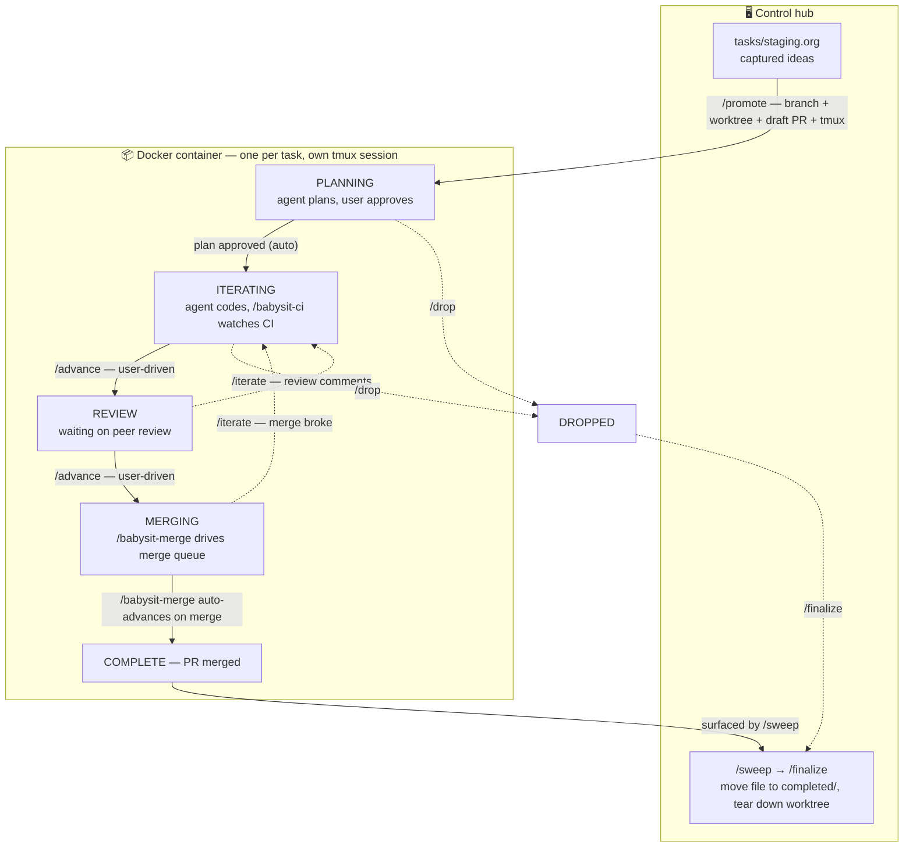

# cloude

Personal tools for parallelizing and managing development with Claude Code.

## What this is for

This repo is a workspace for scripts, configs, and utilities that support
agent-driven development end-to-end — from picking up a task to landing it.

Beyond the mechanical overhead of running Claude Code (worktrees, branches,
PR triage, scheduled jobs, etc.), the larger goal is to manage the
*workflow* of development tasks from beginning to end. Agents change the
shape of that workflow: they enable — and require — far more multitasking
than solo development, with several pieces of work in flight at once and
agents running unattended in the background.

That makes it essential to have a well-defined workflow that distinguishes:

- **Foreground work** — tasks that need active developer attention
  (decisions, reviews, ambiguous requirements, risky changes).
- **Background work** — tasks an agent can run to completion alone, with
  the developer only checking results when they land.

The tools in this repo exist to make that distinction explicit and to keep
the right things flowing through the right lane.

## Quickstart

New to cloude? This section is the fast path — prerequisites, one-time
setup, the workflow at a glance, and one task taken from idea to merged
PR. The sections below it are the full reference.

### Prerequisites

- **Docker**, with the daemon running — every task's agent runs in a
  sandboxed container.
- **[`uv`](https://docs.astral.sh/uv/)** — runs the PEP 723 scripts
  (`bin/cloude-dash` and the org-file helpers) with their dependencies
  handled transparently.
- **`gh`**, authenticated (`gh auth login`) — used to open and manage PRs.
- **`git`**.
- **Claude Code** — the `claude` CLI.

### One-time setup

```sh
make build       # build the container image (a few minutes the first time)
make login       # interactive claude login — do this once per workstation
```

After `make login` exits, your Claude credentials live in the
`cloude-claude-creds` Docker volume and persist across every task and
restart, so you won't need to log in again.

### The workflow at a glance



Solid arrows are the happy path; dashed arrows are the escape hatches
(`/iterate` back a stage, `/drop` to abandon). Note the split: you work
from the **control hub** — capturing ideas, promoting, and cleaning
up — while each task's agent runs in its **own container and tmux
session**. Forward
transitions out of `PLANNING`, `ITERATING`, and `REVIEW` are user-driven;
only `MERGING → COMPLETE` advances on its own.

### Your first task

1. **Capture the idea.** Add a sub-heading under a project in
   `tasks/staging.org`. The project's top-level heading needs a `:REPO:`
   property pointing at its GitHub repo (see [staging.org
   structure](#stagingorg-structure)).
2. **Promote it.** Run `/promote` from your host Claude session. It
   creates the active task file, a `cloude/<slug>` branch, a worktree, a
   draft PR, and a detached `cloude-<slug>` tmux session. The task starts
   in `PLANNING :user:` — waiting for you.
3. **Plan.** Attach to the task's tmux session (`tmux attach -t
   cloude-<slug>`, or press `t` on the dashboard) and give the agent a
   planning prompt. When you approve its plan, a hook flips the task to
   `ITERATING` automatically.
4. **Iterate.** The agent implements the plan and pushes; `/babysit-ci`
   watches CI after each push. When a stage's work is done the agent
   flips its tag to `:user:` — that's your cue to run `/advance` to move
   `ITERATING → REVIEW → MERGING`.
5. **Merge.** In `MERGING`, `/babysit-merge` drives the merge queue and
   auto-advances the task to `COMPLETE` once the PR lands.
6. **Clean up.** Back on the host, `/sweep` surfaces finished tasks and
   `/finalize` moves the file to `tasks/completed/` and tears down the
   worktree, tmux session, and branch.

### Your control hub

You run cloude from a single long-lived tmux session — your *control
hub* — split into two panes:

- **A host Claude session** in the cloude repo. This is where you
  *start* and *retire* tasks: `/promote` to spin one up, `/sweep` and
  `/finalize` to clean it up once it's merged. It never writes task
  code itself.
- **The dashboard**, `bin/cloude-dash` — a TUI listing every task with
  its stage and a colour-coded who-has-the-ball tag: green `:agent:`
  (running on its own), yellow `:user:` (waiting on you), red
  `:blocked:` (waiting on something external).

The work itself happens elsewhere — every task `/promote` creates gets
its own container and tmux session with its own Claude agent. The
control hub is mission control: you start and clean up tasks in the
host pane, and monitor all the in-flight ones from the dashboard pane.

The yellow dashboard rows are the point — the tasks that need feedback
right now (a planning prompt, a plan to approve, a decision). Highlight
one, press `t` to jump straight into its tmux session, give the agent
what it needs, then return to the dashboard and press `t` on the next
yellow row. You monitor from the hub and dip into the task sessions
only where attention is wanted, so background work stays in the
background.

```sh
bin/cloude-dash    # p: open PR · t: switch to task tmux · r: reload · q: quit
```

See [Dashboard](#dashboard) for the full key list.

### Where to go next

- [Workflow states](#workflow-states) — what each TODO keyword means.
- [Lifecycle](#lifecycle) — the same path, in reference form.
- [Slash commands](#slash-commands) — full detail on `/promote`,
  `/advance`, `/babysit-ci`, `/finalize`, and the rest.
- [Running tasks in Docker](#running-tasks-in-docker) — how the
  per-task container is wired up.

## Task tracking

Each chunk of work — its current state and full history — is tracked in an
Emacs `org-mode` file. The layout is designed so that multiple agents can
update task state concurrently without conflicting:

```
tasks/
  staging.org            ;; lightweight captures, not yet started
  active/                ;; one file per in-flight task
    YYYY-MM-DD-<slug>.org
  completed/             ;; one file per merged task (COMPLETE)
    YYYY-MM-DD-<slug>.org
  dropped/               ;; one file per abandoned task (DROPPED)
    YYYY-MM-DD-<slug>.org
  TEMPLATE.org           ;; scaffold for new active tasks (copy, don't edit)
```

- **Top-level state** is encoded by which directory a task lives in
  (`tasks/staging.org` → `tasks/active/` → `tasks/completed/` or
  `tasks/dropped/`). The high-level overview comes from directory
  listings, not a global index file.
- **Workflow stage** is encoded by the TODO keyword inside each active
  file (see below), so org-mode's logbook captures every state transition.
- **One file per task** means each agent edits its own file. Concurrent
  agents updating their own tasks don't conflict.

### Workflow states

| State        | Meaning                                                                      | Can move to                  |
| ------------ | ---------------------------------------------------------------------------- | ---------------------------- |
| `PLANNING`   | Claude is planning the work.                                                  | `ITERATING`, `DROPPED`       |
| `ITERATING`  | Claude is writing code, running tests, updating the PR, waiting on CI.        | `REVIEW`, `DROPPED`          |
| `REVIEW`     | PR is open for peer review, waiting on comments.                              | `ITERATING`, `MERGING`, `DROPPED` |
| `MERGING`    | PR is approved and ready to merge.                                            | `COMPLETE`, `DROPPED`        |
| `COMPLETE`   | PR is merged. Terminal.                                                       | —                            |
| `DROPPED`    | Task abandoned. Terminal.                                                     | —                            |

Forward transitions out of `PLANNING`, `ITERATING`, and `REVIEW` are
**user-driven only** — the agent does not advance these states on its
own; it must wait for the user to make the call. Any state can transition
to `DROPPED` at any time.

### Who-has-the-ball tag

Every in-flight task carries an org tag on its heading indicating who
currently has the ball:

- `:agent:` — the agent is working autonomously.
- `:user:` — the ball is in the user's court (the agent is waiting on
  user feedback, a decision, or a prompt to continue).
- `:blocked:` — waiting on something external to this workflow (peer
  reviewers, long-running external CI, an upstream dependency, etc.).

The agent flips its own tag as it transitions between working, waiting
on the user, and waiting on something external. It does **not** advance
the TODO state itself (except `MERGING → COMPLETE`) — that's the user's
call.

### Stage details and tag defaults

Per-stage responsibilities, definition of done, and `:agent:` /
`:user:` / `:blocked:` defaults are the agent's canonical spec — they
live in `CLAUDE.md` so they get loaded automatically into every Claude
session.

### staging.org structure

Top-level headings in `tasks/staging.org` are **projects**. A project
carries a `:REPO:` property pointing to its GitHub repo, so when a
task is promoted from staging to active the agent knows which repo to
open a branch in. Ideas live as sub-headings under their project:

```org
* cloude
  :PROPERTIES:
  :REPO: https://github.com/<org>/cloude
  :END:
** Add a task-promotion script
** Hook to auto-move COMPLETE files
```

A top-level heading **without** `:REPO:` is treated as a **TODO
project** — its sub-headings are personal TODOs the user works on
themselves, not promotable agent-driven tasks. On the dashboard each
entry appears under a section header that matches its org TODO
keyword (`DONE`, `WAITING`, …), with entries that have no keyword
falling back to a default `TODO` section. `/promote` skips them:

```org
* Non-cloude
** Get recall precision curve for recent predictions in live nation
** Reply to the design doc thread
```

You can delete TODOs when finished — there's no separate
"completed" pile for them.

### Active task properties

Each active task file's top-level heading carries a properties drawer
with the metadata needed to act on the task without hunting:

| Property         | Meaning                                                        |
| ---------------- | -------------------------------------------------------------- |
| `:ID:`           | Stable task identifier, matches the filename (`YYYY-MM-DD-<slug>`). |
| `:REPO:`         | GitHub repo the task lives in. Carried from the staging project. |
| `:BRANCH:`       | Feature branch name in the repo.                                |
| `:WORKTREE:`     | Local git worktree path where the agent works.                  |
| `:PR:`           | Pull request URL once the draft PR exists.                      |
| `:AGENT:`        | Link to the agent session driving the task.                     |
| `:ADOPTED:`      | *(optional)* `t` if the task was promoted in ADOPT mode (existing PR adopted, not freshly created). |
| `:COMPANION_PR:` | *(optional)* URL of a related PR this task pairs with — e.g., an acme-webapp companion to an acme-service PR. Used when work spans two PRs that should land together. |

`:ID:` and `:REPO:` are set when the task is promoted from staging.
The rest are filled in as the task progresses (branch + worktree at
the start of `PLANNING`, `:PR:` at the end of `PLANNING`, `:AGENT:`
whenever an agent is attached). `:ADOPTED:` and `:COMPANION_PR:` are
set by `/promote` when the situation applies; they're omitted on
ordinary tasks.

### Lifecycle

1. Capture the idea in `tasks/staging.org` as a sub-heading under the right
   project (create the project heading if it doesn't exist yet).
2. When ready to start, run `/promote` (see "Slash commands" below).
   The skill walks through staging interactively, then sets up the
   active task file, a feature branch, a worktree under `worktrees/`, a draft
   PR, and a detached tmux session. Initial state is `PLANNING` with
   the `:user:` tag — the task is waiting for the user's planning
   prompt.
3. Update the TODO keyword as the task moves through stages, and flip
   the `:agent:`/`:user:` tag as the agent moves between working and
   waiting.
4. When the task reaches `COMPLETE`, move the file into
   `tasks/completed/`; when it reaches `DROPPED`, move the file into
   `tasks/dropped/`. Filename unchanged in either case.

## Dashboard

`bin/cloude-dash` is a curses TUI that surfaces the state of every task
in one screen. It parses each `tasks/**/*.org` file with `orgparse` and
renders the following sections:

- **ACTIVE** — one row per file in `tasks/active/`, sorted by stage
  priority (`MERGING` first, then `REVIEW`, `ITERATING`, `PLANNING`).
  Each row shows the TODO keyword, who currently has the ball
  (`:agent:` green, `:user:` yellow, `:blocked:` red), the heading, and
  the PR number from the `:PR:` property.
- **STAGING** — idea sub-headings under top-level projects that have a
  `:REPO:` property (i.e. promotable via `/promote`).
- **One section per TODO keyword** for idea sub-headings under
  top-level projects that have no `:REPO:` (personal TODOs the user
  works on without an agent). The keyword itself is the section
  header — e.g. `DONE`, `WAITING`. Entries with no keyword fall back
  to a default `TODO` header. These sections render alphabetically by
  keyword between `STAGING` and `RECENT`, and each row is prefixed
  with the project name in brackets (e.g. `[Live Nation] …`). Not
  promotable.
- **RECENT** — the 20 most-recently-touched files from
  `tasks/completed/` and `tasks/dropped/`.

Keys: `↑`/`↓` or `j`/`k` move, `g`/`G` jump to top/bottom, `p` opens
the highlighted task's PR in the default browser, `t` switches to its
`cloude-<slug>` tmux session (uses `tmux switch-client` when the
dashboard is already inside tmux, otherwise `tmux attach`), `r`
reloads, `q` quits.

```sh
bin/cloude-dash
```

The script has a PEP 723 inline-dependency header, so the recommended
launcher is `uv` — it handles the `orgparse` install transparently.
If `uv` isn't available, `pip install --user orgparse` then run the
script with `python3`.

## Running tasks in Docker

Each active task can be run inside a sandboxed Docker container with
`claude --dangerously-skip-permissions`, so the agent can act without
per-tool permission prompts while staying isolated from the host.

The container:

- Runs Claude Code as an unprivileged `cloude` user whose UID/GID match
  the invoking host user (so files written through bind mounts are
  owned correctly on the host).
- Has Docker-in-Docker (DinD), so `docker compose` works inside. Each
  task gets its own `cloude-dind-<slug>` volume backing
  `/var/lib/docker` — necessary because nested `overlay2` on the
  container's own overlay layer hits whiteout permission errors, and
  because multiple in-flight tasks can't share one docker data dir
  (dockerd holds an exclusive lock). The volume persists across
  restarts of the same task to cache pulled images.
- Persists Claude credentials/history in a named volume
  (`cloude-claude-creds`), so login is required only once per
  workstation.
- Inherits git, gh, and docker-registry auth read-only from the host's
  `~/.gitconfig`, `~/.config/gh`, and `~/.docker/config.json` (the
  docker config mount is optional — skipped if absent). Mounting
  `~/.docker/config.json` lets the in-container `docker pull` reach
  private registries the host is logged into (e.g. ghcr.io).
- The host's `GH_TOKEN` env var is forwarded into the container (when
  set) so `gh` and the git credential helper baked into
  `/etc/gitconfig` can authenticate against GitHub for HTTPS `git
  fetch`/`push`. SSH-form remotes are not supported inside the
  container (no SSH keys mounted); `/promote` clones via HTTPS to
  avoid this.
- Mounts the cloude repo at the same absolute path it has on the host
  (read-only) plus rw overlays for the task's source clone, worktree,
  and active `.org` file. Other tasks remain read-only.

### One-time setup

```sh
make build       # build the image (takes a few minutes the first time)
make login       # run claude interactively to perform the first-time login
```

After `make login` exits, credentials live in the `cloude-claude-creds`
volume and persist across runs.

### Launching a task

`/promote` automatically starts the container in the task's tmux
session. To launch (or relaunch) by hand:

```sh
bin/cloude-run <worktree-abs-path> <task-file-abs-path>
```

Both arguments are absolute paths the caller already has — `cloude-run`
doesn't look up tasks by slug or parse org files.

### Per-repo pre-launch hooks

Some projects ship config that doesn't behave inside the container —
plugin entries pointing at host binaries, project skills that depend
on external services, etc. To shape the worktree before the container
starts, drop an executable script at:

```
repo-hooks/<repo-name>          (e.g. repo-hooks/acme-webapp)
```

`cloude-run` invokes the hook (if present and executable) with cwd =
the worktree, just before launching the container. The hook gets these
env vars:

- `CLOUDE_WORKTREE` — absolute path of the task worktree.
- `CLOUDE_TASK_FILE` — absolute path of the active task `.org` file.
- `CLOUDE_REPO_NAME` — the repo name (matches the hook filename).

A failed hook (nonzero exit) aborts the launch.

Typical use: delete or edit a file the container shouldn't see, then
hide the change from `git status` via `git update-index
--skip-worktree <file>` (for tracked files) or by appending to
`.git/info/exclude` (for untracked files). Worktrees have their own
`index` and `info/exclude`, so these changes are isolated to the one
worktree.

### In-container hooks

`docker/cloude-settings.json` registers Claude Code hooks that fire
inside the container, keeping the task heading's TODO keyword and
who-has-the-ball tag in sync with what the agent is actually doing:

- **`PostToolUse:ExitPlanMode` → `bin/cloude-on-plan-accepted`.** When
  the user accepts a plan in plan mode and the task is in `PLANNING`,
  writes the accepted plan into the task file's `** Plan` section and
  flips the heading to `ITERATING :agent:`. Lets the agent start
  implementing on its next turn without a separate `/advance` step.
- **`Stop` → `bin/cloude-on-stop`.** Fires at the end of every agent
  turn. If the task is in an in-flight stage (PLANNING / ITERATING /
  REVIEW / MERGING) with tag `:agent:`, blocks the stop once and
  reminds the agent of that stage's Definition of Done plus the
  available tag-flipping outcomes (`:user:` / `:blocked:` / keep
  `:agent:` and continue). Honors `stop_hook_active` to block only
  once per stop cycle. Keeps the `bin/cloude-dash` dashboard honest
  about which tasks are actually still being worked vs. waiting on
  the user.

The settings file is baked into the image (Dockerfile `COPY
docker/cloude-settings.json /etc/cloude/settings.json`) and surfaced
to the in-container `claude` via `--settings
/etc/cloude/settings.json` (added by `bin/cloude-run`). The hook
scripts themselves live in `bin/` and are read via the read-only
bind mount of the cloude repo, so editing them needs no image
rebuild — only changes to `cloude-settings.json` do.

### Make targets

- `make build` / `make rebuild` — build (cached) / rebuild (no cache).
- `make shell` — bash shell in a transient container, for debugging the
  image without a real task.
- `make login` — interactive `claude` in a clean container; first-time
  login flow.
- `make info` — image and volume status.
- `make clean-image` / `make clean-volume` / `make clean-dind-data` /
  `make clean` — teardown. `clean-volume` erases saved credentials;
  `clean-dind-data` removes every per-task `cloude-dind-*` volume
  (image caches inside containers).

## Slash commands

Project-scoped slash commands live in `.claude/commands/`. Available
commands:

- **`/promote`** — Promote an idea from `tasks/staging.org` into an
  active task. Interactive: lists ideas grouped by project, asks which
  to promote, auto-slugs the heading. Two modes:
  - **Standard**: creates the active task file under `tasks/active/`,
    a `cloude/<slug>` branch in the project's repo off the default
    branch, a worktree under `worktrees/<repo-name>/<slug>`, a draft
    PR, and a detached tmux session named `cloude-<slug>`. Starts in
    `PLANNING :user:`.
  - **ADOPT**: triggered when the staging idea is `ADOPT <PR url>`.
    No new branch or PR — checks out the existing PR's branch as a
    worktree, uses the PR's title for the task heading, and starts in
    `ITERATING :user:` so the user can direct the agent on what to do
    with the adopted work. Refuses to adopt closed/merged or
    cross-repository (forked) PRs.

  Source clones are kept in `repos/<repo-name>` (auto-cloned on first
  use); worktrees share that clone's git object store. Both `repos/`
  and `worktrees/` are gitignored.
- **`/advance`** *(in-container)* — Advance the task's TODO keyword
  forward to the next workflow stage (`PLANNING → ITERATING →
  REVIEW → MERGING → COMPLETE`). Loads the current stage's
  Definition of Done from `CLAUDE.md`, evaluates each item
  (programmatically where it can — PR exists, CI status, git
  clean — and via the agent's judgment for the rest), and
  complains (lists unmet items + asks for explicit confirm)
  before the transition lands. Only edits `$CLOUDE_TASK_FILE`;
  the host sees the diff afterward.
- **`/iterate`** *(in-container)* — Flip the TODO keyword back to
  `ITERATING` (with `:agent:` tag). Used when review comments come
  in on a `REVIEW` PR, or a `MERGING` task hits a merge break. No
  preconditions; mechanical.
- **`/drop`** *(in-container)* — Flip the TODO keyword to
  `DROPPED` (with `:user:` tag) from any non-terminal state.
  Refuses to drop from `COMPLETE` (work already landed); no-op
  from `DROPPED`. Reminds the agent that the host now needs
  `/sweep` (or `/finalize` directly) to do the actual cleanup.
- **`/babysit-ci`** *(in-container)* — Monitor CI on the task's PR
  autonomously after a push. Push-driven: kicks off `gh pr checks
  --watch` as a background bash; the harness fires a new turn when
  the watch returns. On that turn, the agent reads the result —
  **green flips the heading tag to `:user:` and stops** (does not
  auto-advance the TODO state — advancing forward is user-driven),
  failures get diagnosed, fixed (commit + push), and watched again.
  **Merge conflicts** against the base branch are also part of the
  job: the agent merges the latest base in, resolves trivial
  conflicts (lockfiles, append-only, formatting), and re-pushes —
  bailing to `:user:` only when a conflict genuinely needs human
  judgment. Budgets: 2h wall-clock, 3 post-fix retries per failing
  check (and per conflict cycle). On bail, flips the heading tag to
  `:user:` so the user knows attention is needed. Zero token cost
  during the watch — Claude is fully idle until CI ends.
- **`/babysit-merge`** *(in-container)* — MERGING-stage equivalent
  of `/babysit-ci`. Adds the PR to the repo's merge queue, watches
  via background bash, re-queues on transient ejections — "keep
  re-adding until it merges." On a successful merge, **auto-advances
  the heading to `COMPLETE :user:`** (the one forward transition
  CLAUDE.md designates agent-advanceable, since `/sweep` on the host
  then surfaces it for `/finalize`). On any blocking condition
  (failing required check, requested changes, merge conflict, branch
  protection refusal), **kicks the task back to `ITERATING :user:`**
  with a one-paragraph explanation appended to `** Notes` —
  conflict resolution is `/babysit-ci`'s job during ITERATING, not
  this skill's. Budget: 2h wall-clock; no fixed cap on re-queue
  attempts.
- **`/sweep`** — Scan `tasks/active/` for tasks whose TODO keyword is
  already `COMPLETE` or `DROPPED` (the in-container agent has flipped
  the state but the file is still in `active/`). For each candidate,
  prompts you per-task with `Approve /finalize for <task>? [y/N/skip]`
  and only invokes `/finalize` on an explicit `y`. Quick to run (one
  line of output when nothing's pending), so safe to drive on a `/loop`
  poll (e.g. `/loop 1m /sweep`) in your main host session.
- **`/finalize`** — Finalize an active task and perform the cleanup
  the in-container agent can't do (the cloude repo is mounted ro from
  inside the container). Interactive: lists active tasks with their
  current TODO state, asks which to finalize. For `COMPLETE`,
  verifies the PR is merged, kills the tmux session, removes the
  worktree, removes the task's `cloude-dind-<slug>` DinD volume,
  deletes the local branch, and moves the task file to
  `tasks/completed/`. For `DROPPED`, closes the PR, kills the tmux
  session, removes the worktree, removes the DinD volume, preserves
  the local branch, and moves the file to `tasks/dropped/`.
  Force-drop is allowed from any non-terminal state; force-complete
  is not (COMPLETE requires the agent to have verified the merge).

### Helper scripts in `bin/`

`/promote`, `/sweep`, and `/finalize` are thin interactive wrappers
around a small set of `bin/` orchestrators. Each script is callable
by hand too (e.g. for scripting outside the skills, or when
debugging). Scripts that read or edit `.org` files are Python with a
PEP 723 inline-deps header (same pattern as `bin/cloude-dash`) and
are intended to be run via `uv` — see the Dashboard section for the
`orgparse` install story.

- **`cloude-list-staging`** — Print promotable ideas from
  `tasks/staging.org` numbered globally, plus a trailing
  `TODO_PROJECTS <n>` count of personal-TODO projects (no `:REPO:`)
  that `/promote` skips. Used by `/promote` step 1.
- **`cloude-list-active`** — Print active tasks under
  `tasks/active/`, numbered, sorted by stage priority (matching the
  dashboard's `MERGING → REVIEW → ITERATING → PLANNING` order). With
  `--terminal`, filters to `COMPLETE`/`DROPPED`; if the filtered set
  is empty, prints exactly `No tasks awaiting finalize.` and exits 0
  — this is `/sweep`'s idle-tick output and what makes a `/loop
  /sweep` cheap. Used by `/sweep` and `/finalize` step 1.
- **`cloude-task-info <task-file>`** — Emit `KEY=VALUE` (shell-safe)
  lines for the heading TODO/tag/text, the properties drawer
  (`WORKTREE`, `BRANCH`, `PR`, `REPO`, `ID`, plus `ADOPTED` /
  `COMPANION_PR` when present), and derived fields (`SLUG`,
  `REPO_NAME`, `SOURCE_CLONE`, `TMUX_SESSION`, `DIND_VOLUME`,
  `CLOUDE_ROOT`). Sourced by `cloude-finalize-cleanup`. Exit 3
  names the missing key when a required property is absent.
- **`cloude-promote-setup`** — Bash orchestrator for `/promote`
  steps 4-9: ensure source clone, create worktree + branch, push
  (standard) or fetch (ADOPT), open draft PR (standard only),
  render task file from `tasks/TEMPLATE.org`, remove staging entry,
  start tmux session. Distinct non-zero exit codes per failure mode
  (10 clone, 11 worktree, 12 PR, 13 render, 14 staging removal, 20
  tmux collision, 30 arg validation) and a "Succeeded so far" trail
  on stderr.
- **`cloude-finalize-cleanup <task-file>`** — Bash orchestrator for
  `/finalize` steps 4-10: verify/close PR, kill tmux, remove
  worktree, remove DinD volume, delete branch (COMPLETE only), move
  task file. Bails with distinct exit codes for the four
  judgment-call cases:
  - `10` — PR not in state `MERGED` (the agent set `COMPLETE`
    prematurely).
  - `11` — task TODO is not `COMPLETE`/`DROPPED`. Pass
    `--force-drop` to flip to `DROPPED` and proceed.
  - `12` — worktree dirty/locked. Pass `--force-worktree` to retry
    with `git worktree remove --force`.
  - `13` — DinD volume still in use. Pass `--skip-volume` to leave
    it in place.

  The skill is responsible for prompting the user and rerunning with
  the matching override; the script itself has no interactive
  fallback logic.
